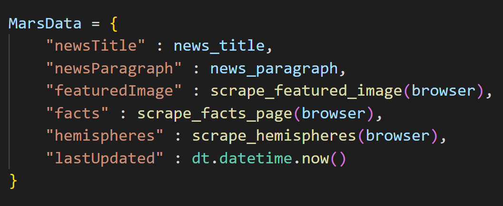
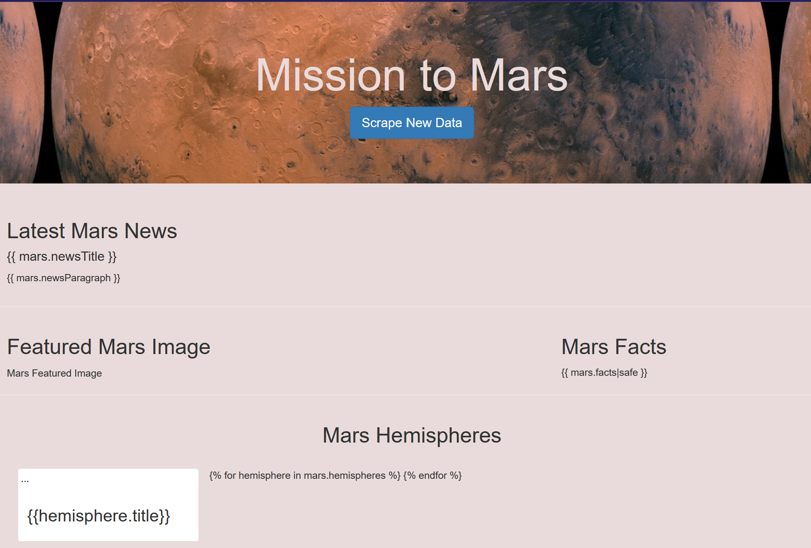

# Module 12: Web Scraping Challenge 

# Mission to Mars 

Resources

    Web pages scraped:
        https://data-class-mars.s3.amazonaws.com/Mars/index.html
        https://spaceimages-mars.com
        https://galaxyfacts-mars.com
        https://marshemispheres.com/

    Software:
        Python
        Jupyter Notebook
        Pandas, BeautifulSoup, Splinter, ChromeDriverManager, Flask, PyMongo
        MongoDB
        HTML
        Bootstrap 

# Step 1: Scraping

Initial scraping of the above websites was completed using Jupyter Notebook, BeautifulSoup, Pandas, and Requests/Splinter:

    - NASA Mars News Site:
        The latest news title and the paragraph text

    - JPL Mars Space Featured Image:
        Title and the image url for the current Featured Space image

    - Mars Facts:
        Retreive Mars facts table and use Pandas to convert the data to a HTML table string

    - Mars Hemispheres:
        Title and image url of each hemisphere 

### Work Sample
     

#  Step 2: MongoDB and Flask Application

    Use MongoDB with Flask to produce a final HTML page which displays all the information that was scraped from above.
    
    Create a root route ("/") that will query the MongoDB and pass the data into the HTML template.
    
    Create a template index.html that will take the scraped Mars data  and display it all in the appropriate HTML elements as per the given example 

### Work Sample
  

### Landing page ('/')

Create an initial landing page with a function button to scrape the data by calling the /scrape route.

### Work Sample

### Data display ('/data')

The /scrape route redirects to a new route which renders the html template, creates the display of scraped data using Bootstrap. This page also has a 'Scrape New Data' button that calls the /scrape route again if needed.

### Work Sample
